# Plan d'implémentation — Orchestration hiérarchique

> **Statut** : Implémentation terminée — 2026-03-23 — Design unifié (Option C)
> **Auteur** : @Dr0drigues + Claude
> **Version cible** : 0.11.0
> **Dépendance** : PR #91 (@xbattlax — Blackboard + Ring)

---

## 1. Vision

Transformer ArmadAI d'un exécuteur d'agents single-shot en un **orchestrateur multi-pattern** unifié.

### 1.1. Les 4 patterns d'orchestration

| Pattern | Source | Philosophie | Quand l'utiliser |
|---------|--------|-------------|------------------|
| **Direct** | Existant | Single-shot, un agent | Tâches simples |
| **Blackboard** | PR #91 | Parallèle, intelligence émergente | Sous-domaines indépendants |
| **Ring** | PR #91 | Séquentiel, consensus par vote | Critique croisée, décisions |
| **Hierarchical** | Ce plan | Pyramide coord → leads → agents | Tâches complexes multi-équipes |

### 1.2. Objectif du pattern Hierarchical

- L'utilisateur parle **uniquement** au coordinateur
- Le coordinateur **décompose, délègue et synthétise**
- Les sous-coordinateurs (leads) gèrent leurs équipes
- Les agents d'un même étage peuvent **communiquer latéralement**
- Le tout fonctionne avec **n'importe quel provider LLM**

### 1.3. Design unifié avec PR #91

La PR #91 de @xbattlax crée le module `src/core/orchestration/` avec Blackboard et Ring.
Notre travail **s'intègre dans ce module** en ajoutant le pattern Hierarchical et en étendant
le classifier pour router vers les 4 patterns.

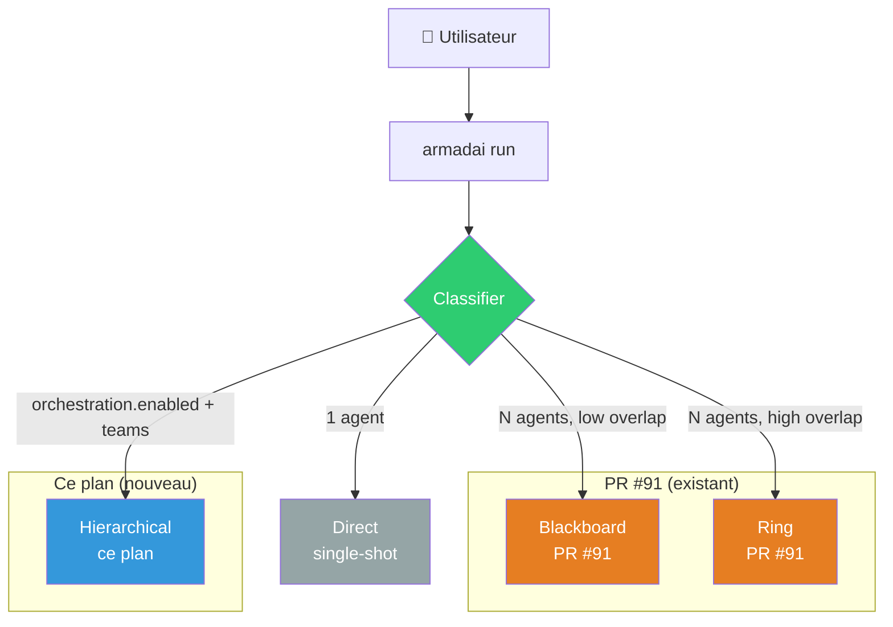

---

## 2. Architecture générale

### 2.1. Topologie en pyramide

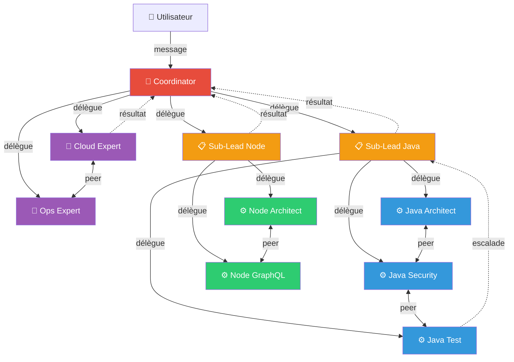

### 2.2. Rôles

| Rôle | Couleur | Responsabilité |
|------|---------|----------------|
| **Coordinator** | 🔴 | Point d'entrée unique. Décompose, délègue, synthétise. |
| **Sub-Lead** | 🟠 | Sous-coordinateur d'équipe. Connaît ses agents. |
| **Agent** | 🔵🟢🟣 | Spécialiste. Exécute, peut parler à ses pairs. |

### 2.3. Types de communication

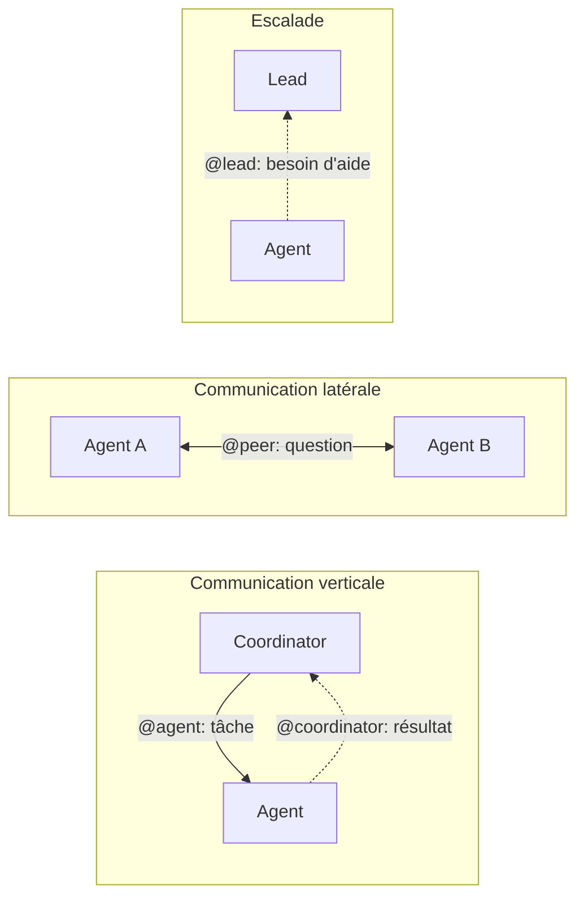

---

## 3. Configuration YAML

### 3.1. Schema unifié (PR #91 + Hierarchical)

La PR #91 ajoute déjà une section `orchestration` à `ProjectConfig` avec des paramètres
pour Blackboard et Ring (`max_rounds`, `max_laps`, `consensus_threshold`, `token_budget`).
Notre plan **étend** cette section avec le pattern `hierarchical`.

```yaml
# armadai.yaml / .armadai/config.yaml
orchestration:
  # ── Pattern selection ────────────────────────────────────
  enabled: true                    # Active le mode orchestration
  pattern: hierarchical            # direct | blackboard | ring | hierarchical | auto
                                   # (auto = classifier heuristique de la PR #91)

  # ── Hierarchical-specific ────────────────────────────────
  coordinator: boulanger-architect # Agent coordinateur principal (hierarchical only)

  teams:                           # Topologie d'équipes (hierarchical only)
    # Équipe avec sous-coordinateur
    - lead: platodin-java-lead
      agents:
        - platodin-java-architect
        - platodin-java-security-expert
        - platodin-java-test-expert
        - platodin-java-data-expert

    # Autre équipe avec sous-coordinateur
    - lead: platodin-node-lead
      agents:
        - platodin-node-architect
        - platodin-node-graphql-expert
        - platodin-node-security-expert

    # Agents directement rattachés au coordinateur (pas de lead)
    - agents:
        - boulanger-cloud-expert
        - boulanger-ops-expert
        - boulanger-data-expert

  # ── Shared limits (all patterns) ─────────────────────────
  max_depth: 5                     # Profondeur max de délégation (défaut: 5)
  max_iterations: 50               # Iterations totales max (défaut: 50)
  timeout: 300                     # Timeout global en secondes (défaut: 300)

  # ── PR #91 parameters (blackboard/ring) ──────────────────
  max_rounds: 5                    # Blackboard: max rounds (défaut: 5)
  max_laps: 3                      # Ring: max token laps (défaut: 3)
  consensus_threshold: 0.75        # Seuil de consensus (défaut: 0.75)
  token_budget: 100000             # Budget tokens global (défaut: 100000)
```

### 3.2. Structs Rust correspondantes

```rust
/// Unified orchestration configuration (extends PR #91).
#[derive(Debug, Clone, Deserialize, Default)]
#[serde(default)]
pub struct OrchestrationConfig {
    pub enabled: bool,
    pub pattern: OrchestrationPattern,  // extends PR #91's enum

    // ── Hierarchical-specific ──
    pub coordinator: Option<String>,
    pub teams: Vec<TeamConfig>,

    // ── Shared limits ──
    pub max_depth: Option<u32>,         // default: 5
    pub max_iterations: Option<u32>,    // default: 50
    pub timeout: Option<u64>,           // default: 300s

    // ── PR #91 parameters ──
    pub max_rounds: Option<u32>,        // Blackboard
    pub max_laps: Option<u32>,          // Ring
    pub consensus_threshold: Option<f32>,
    pub token_budget: Option<u64>,
}

/// Extends PR #91's OrchestrationPattern with Hierarchical.
#[derive(Debug, Clone, Copy, PartialEq, Eq, Deserialize, Default)]
#[serde(rename_all = "lowercase")]
pub enum OrchestrationPattern {
    #[default]
    Direct,
    Blackboard,
    Ring,
    Hierarchical,  // NEW
    Auto,          // classifier picks (PR #91's heuristic + hierarchical detection)
}

#[derive(Debug, Clone, Deserialize)]
pub struct TeamConfig {
    pub lead: Option<String>,
    pub agents: Vec<String>,
}
```

### 3.3. Interaction entre `pattern` et `enabled`

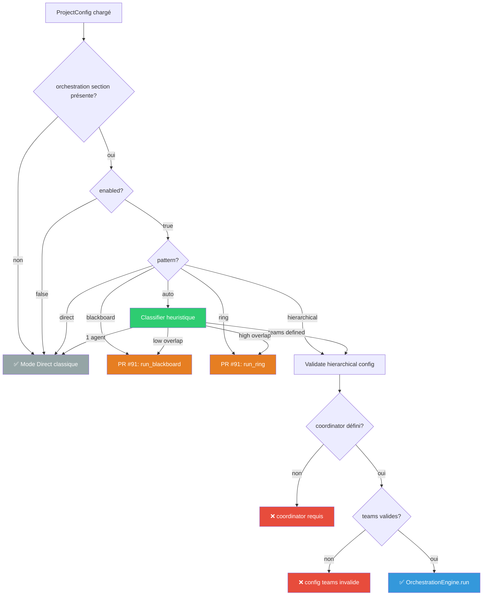

### 3.3. Validation

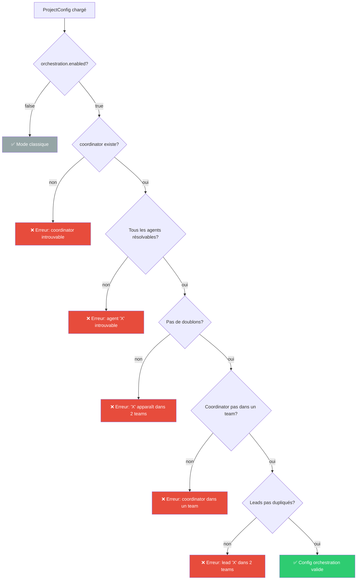

---

## 4. Protocole de délégation

### 4.1. Syntaxe textuelle (portable — tous providers)

```
@agent-name: description de la sous-tâche à accomplir
```

Le protocole est **parsé depuis la réponse texte** du LLM. Chaque ligne commençant par `@nom:` est une action.

### 4.2. Actions possibles

| Action | Syntaxe | Émetteur → Cible | Sémantique |
|--------|---------|-------------------|------------|
| **Delegate** | `@subalterne: tâche` | Lead → Agent de son team | Assigner une sous-tâche |
| **AskPeer** | `@pair: question` | Agent → Agent du même team | Question latérale |
| **Escalate** | `@lead: résultat ou demande` | Agent → Son lead/coordinator | Remonter un résultat |
| **FinalAnswer** | *(pas de `@`)* | Tout agent | Réponse finale (pas de délégation) |

### 4.3. Parsing — Enum Rust

```rust
#[derive(Debug, Clone, PartialEq)]
pub enum DelegationAction {
    /// Délégation descendante : coordinator/lead → agent
    Delegate { target: String, task: String },

    /// Question latérale : agent → pair du même team
    AskPeer { target: String, question: String },

    /// Remontée : agent → son lead ou coordinator
    Escalate { target: String, message: String },

    /// Réponse finale sans délégation
    FinalAnswer { content: String },
}
```

### 4.4. Logique de classification

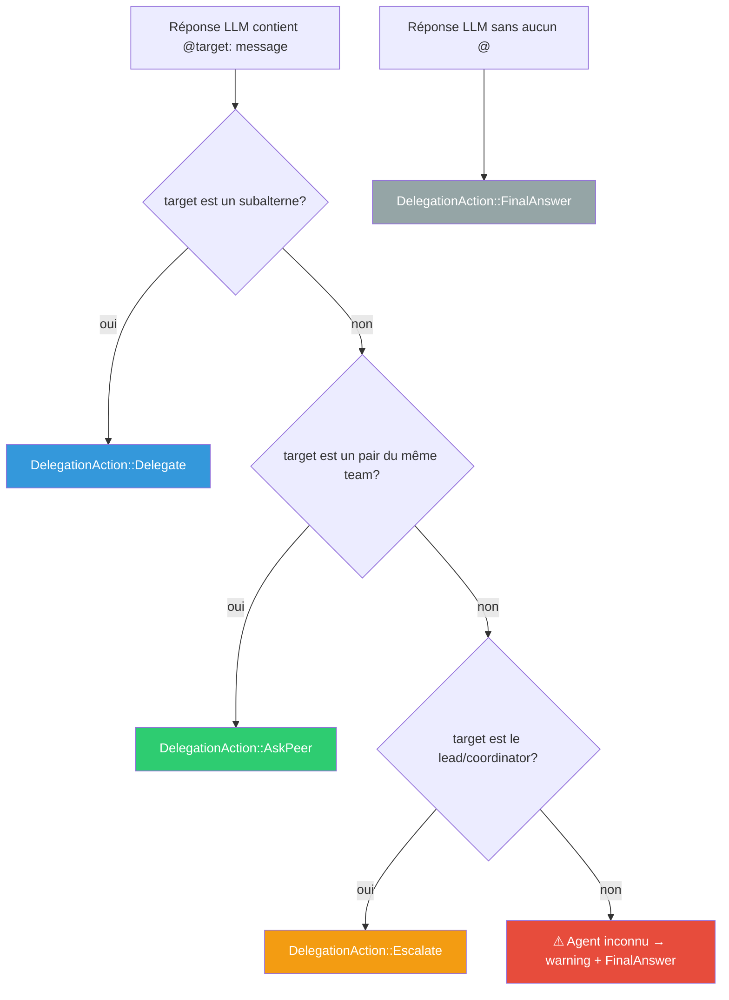

### 4.5. Regex de parsing

```
Pattern : ^@([\w][\w-]*)\s*:\s*(.+)$
Flags   : multiline
Groupe 1: nom de l'agent cible
Groupe 2: contenu du message (tâche, question, résultat)
```

Le texte **hors des patterns `@agent:`** est considéré comme du narratif (ignoré pour la délégation, conservé pour le contexte).

---

## 5. Injection de contexte dans les system prompts

### 5.1. Principe

Quand le mode orchestration est actif, **chaque agent** reçoit un bloc additionnel dans son system prompt décrivant :

1. Son **rôle** dans la hiérarchie
2. Le **protocole de délégation** (`@agent: ...`)
3. La **liste des agents** qu'il peut contacter (avec descriptions)
4. Les **règles** de communication

### 5.2. Template de contexte injecté

#### Pour le Coordinator :

```markdown
## Orchestration Protocol

You are the **coordinator** of this agent team. The user speaks directly to you.

### Your team

| Agent | Role | Type |
|-------|------|------|
| platodin-java-lead | Sub-coordinator for Java team | Lead |
| platodin-node-lead | Sub-coordinator for Node team | Lead |
| boulanger-cloud-expert | Cloud infrastructure specialist | Direct agent |
| boulanger-ops-expert | Operations and monitoring specialist | Direct agent |

### Delegation syntax

To delegate a subtask, write on a new line:
```
@agent-name: description of the subtask
```

You can delegate to multiple agents in the same response.

### Rules

1. Analyze the user's request before delegating
2. If the request is unclear, ask clarifying questions FIRST (do not delegate yet)
3. Delegate to the most appropriate agent(s) based on their specialization
4. For Java-related tasks, delegate to @platodin-java-lead (not directly to Java agents)
5. For Node-related tasks, delegate to @platodin-node-lead
6. For infrastructure/ops tasks, delegate directly to the relevant agent
7. When all subtask results are collected, synthesize a final answer (no @)
8. Never delegate the same subtask to multiple agents
```

#### Pour un Sub-Lead (ex: `platodin-java-lead`) :

```markdown
## Orchestration Protocol

You are the **lead** of the Java team. You report to @boulanger-architect.

### Your team

| Agent | Role |
|-------|------|
| platodin-java-architect | Architecture & design patterns |
| platodin-java-security-expert | Security audits & vulnerability analysis |
| platodin-java-test-expert | Testing strategy & code coverage |
| platodin-java-data-expert | Data layer, JPA, repositories |

### Delegation syntax

To delegate to your agents:
```
@agent-name: description of the subtask
```

To report results back to the coordinator:
```
@boulanger-architect: [results summary]
```

### Rules

1. You receive tasks from @boulanger-architect
2. Decompose the task if needed and delegate to your agents
3. Your agents can talk to each other using @peer-name: ...
4. Synthesize results from your team before reporting back
5. Escalate to @boulanger-architect if the task is outside your team's scope
```

#### Pour un Agent (ex: `platodin-java-security-expert`) :

```markdown
## Orchestration Protocol

You are a **specialist agent** in the Java team. You report to @platodin-java-lead.

### Your peers (same team — you can ask them questions)

| Agent | Role |
|-------|------|
| platodin-java-architect | Architecture & design patterns |
| platodin-java-test-expert | Testing strategy & code coverage |
| platodin-java-data-expert | Data layer, JPA, repositories |

### Communication syntax

To ask a peer for information:
```
@peer-name: your question
```

To report your results back to your lead:
```
@platodin-java-lead: [your results]
```

### Rules

1. You receive tasks from @platodin-java-lead
2. Complete the task using your expertise
3. If you need information from a peer, use @peer-name: question
4. Always report results back to @platodin-java-lead
5. Do NOT delegate tasks — you are a specialist, not a coordinator
6. If the task is outside your expertise, escalate to @platodin-java-lead
```

### 5.3. Flow de génération du contexte

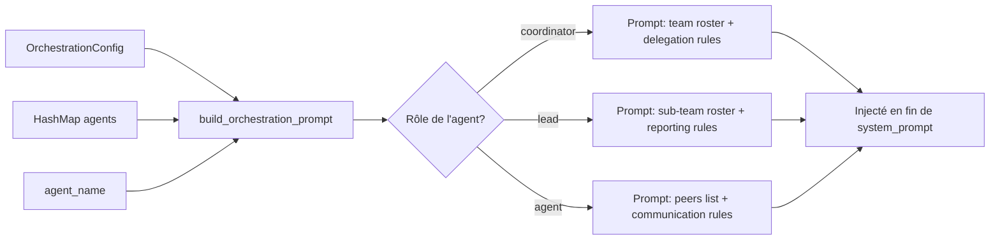

---

## 6. Moteur d'exécution

### 6.1. Vue d'ensemble du flow

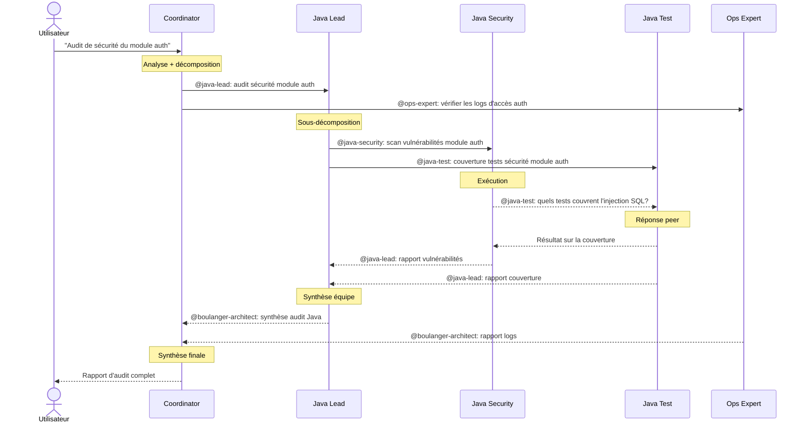

### 6.2. Boucle d'exécution principale

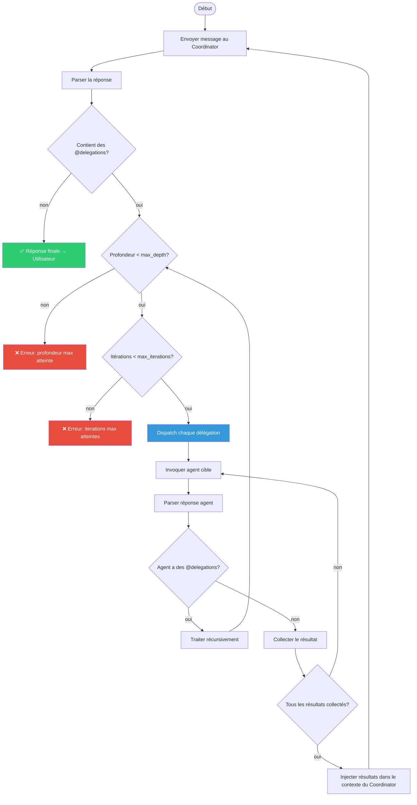

### 6.3. Struct `OrchestrationEngine`

```rust
pub struct OrchestrationEngine {
    /// Orchestration config (topology, limits)
    config: OrchestrationConfig,

    /// All loaded agents, keyed by name
    agents: HashMap<String, Agent>,

    /// Provider factory function (creates provider per agent)
    /// We don't pre-create providers to avoid holding connections
    project_root: PathBuf,

    /// Shared context for conversation history
    context: SharedContext,

    /// Aggregated metrics from all agent invocations
    metrics: Vec<RunMetrics>,

    /// Current iteration count (safety)
    iteration_count: u32,
}
```

### 6.4. Méthodes principales

```rust
impl OrchestrationEngine {
    /// Point d'entrée principal
    pub async fn run(&mut self, user_input: &str) -> Result<OrchestrationResult>;

    /// Invoque un agent spécifique avec un message
    /// Gère la récursion (délégations imbriquées)
    async fn invoke_agent(
        &mut self,
        agent_name: &str,
        input: &str,
        depth: u32,
        sender: &str,       // qui envoie le message
    ) -> Result<String>;

    /// Construit le system prompt enrichi pour un agent
    fn build_enriched_prompt(&self, agent_name: &str) -> String;

    /// Détermine la relation entre deux agents
    fn classify_relationship(
        &self,
        sender: &str,
        target: &str,
    ) -> AgentRelationship;
}

pub enum AgentRelationship {
    /// sender est le lead/coordinator de target
    Superior,
    /// sender et target sont dans le même team
    Peer,
    /// target est le lead/coordinator de sender
    Subordinate,
    /// aucune relation directe
    Unknown,
}

pub struct OrchestrationResult {
    pub content: String,
    pub metrics: Vec<RunMetrics>,
    pub delegation_trace: Vec<DelegationEvent>,
    pub total_cost: f64,
    pub total_duration_ms: u64,
}

pub struct DelegationEvent {
    pub from: String,
    pub to: String,
    pub action: DelegationAction,
    pub depth: u32,
    pub timestamp: DateTime<Utc>,
}
```

### 6.5. Gestion du contexte multi-turn

```mermaid
flowchart TD
    subgraph "Contexte du Coordinator"
        CM1["user: Audit sécurité module auth"]
        CM2["assistant: @java-lead: audit... @ops: logs..."]
        CM3["user: [Résultat java-lead] [Résultat ops]"]
        CM4["assistant: Synthèse finale"]
        CM1 --> CM2 --> CM3 --> CM4
    end

    subgraph "Contexte du Java Lead"
        JM1["user: audit sécurité module auth (de @coordinator)"]
        JM2["assistant: @java-security: scan... @java-test: couverture..."]
        JM3["user: [Résultat security] [Résultat test]"]
        JM4["assistant: @coordinator: synthèse équipe"]
        JM1 --> JM2 --> JM3 --> JM4
    end

    subgraph "Contexte Java Security"
        SM1["user: scan vulnérabilités (de @java-lead)"]
        SM2["assistant: @java-test: tests injection SQL?"]
        SM3["user: [Réponse peer: couverture tests]"]
        SM4["assistant: @java-lead: rapport vulnérabilités"]
        SM1 --> SM2 --> SM3 --> SM4
    end
```

Chaque agent maintient **sa propre conversation** (liste de `ChatMessage`). Les résultats des agents délégués sont injectés comme messages `user` formatés :

```
[Result from @agent-name]
<contenu du résultat>
[End result from @agent-name]
```

---

## 7. Intégration CLI

### 7.1. Flow `armadai run` modifié

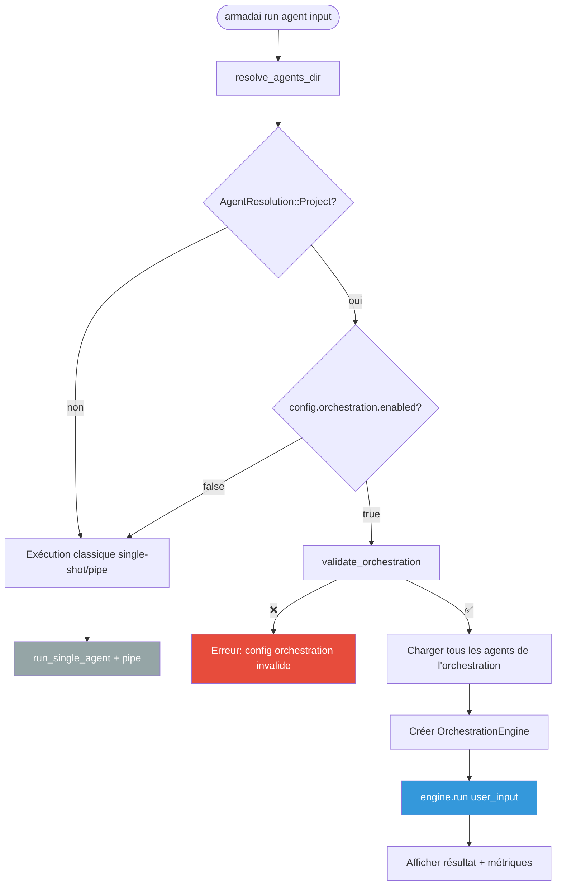

### 7.2. Flow `armadai link` modifié

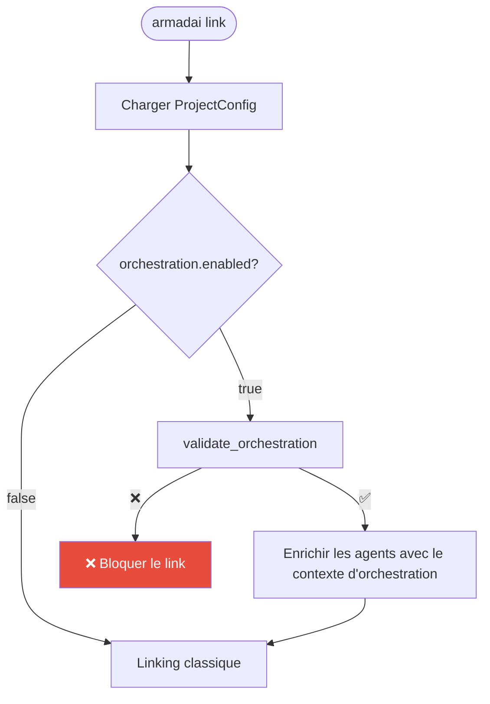

---

## 8. Plan d'implémentation (Option C — Design unifié)

> **Stratégie** : PR #91 est la fondation. Notre travail s'intègre **dans** le module
> `src/core/orchestration/` créé par PR #91, en ajoutant le pattern Hierarchical et
> en étendant le classifier pour router vers les 4 patterns.

### 8.1. Dépendances entre étapes

```mermaid
gantt
    title Plan d'implémentation — Design unifié (Option C)
    dateFormat X
    axisFormat %s

    section Étape 0 — Fondation PR #91
    Merge PR #91 (Blackboard + Ring)       : e0, 0, 1
    Audit code + adapter naming/imports     : e0a, 1, 2

    section Étape 1 — Config unifiée
    Étendre OrchestrationConfig + TeamConfig : e1, 2, 4
    Tests config (4 patterns)                : e1t, 3, 4

    section Étape 2 — Protocole
    DelegationAction + parse_delegations : e2, 4, 6
    Tests parsing                        : e2t, 5, 6

    section Étape 3 — Injection
    build_orchestration_prompt   : e3, 4, 6
    Tests injection              : e3t, 5, 6

    section Étape 4 — Moteur Hierarchical
    HierarchicalEngine + invoke_agent : e4, 6, 10
    Tests moteur (mock provider)      : e4t, 8, 10

    section Étape 5 — Classifier unifié
    Pattern selector (4 patterns + auto) : e5, 10, 11
    Tests classifier                     : e5t, 10, 11

    section Étape 6 — CLI
    Intégration run.rs + link.rs : e6, 11, 12

    section Étape 7 — E2E
    Tests intégration end-to-end : e7, 12, 14
```

### 8.2. Détail par étape

#### Étape 0 : Fondation — Merge et audit de PR #91

| Aspect | Détail |
|--------|--------|
| **Action** | Merger PR #91 (`develop` ← `feature/orchestration-patterns`) |
| **Audit** | Vérifier que le module `src/core/orchestration/` compile, que les tests passent, et que le naming est cohérent avec notre plan unifié. |
| **Adaptations potentielles** | Renommer `OrchestrationPattern` si la PR utilise un nom différent. S'assurer que l'enum est `#[non_exhaustive]` ou extensible pour ajouter `Hierarchical` et `Auto`. Vérifier que `OrchestrationConfig` est `Default`-able. |
| **Livrables PR #91** attendus | `src/core/orchestration/mod.rs`, `blackboard.rs`, `ring.rs`, `OrchestrationPattern::{Blackboard, Ring}`, paramètres `max_rounds`/`max_laps`/`consensus_threshold`/`token_budget`. |
| **Complexité** | 🟡 Moyenne (review + adaptation) |
| **Dépendances** | PR #91 review + CI verte |

#### Étape 1 : Configuration unifiée (extend PR #91)

| Aspect | Détail |
|--------|--------|
| **Fichiers modifiés** | `src/core/project.rs`, `src/core/orchestration/mod.rs` (de PR #91) |
| **Changements** | **Étendre** `OrchestrationConfig` de PR #91 avec : `coordinator: Option<String>`, `teams: Vec<TeamConfig>`, `max_depth`, `max_iterations`, `timeout`. **Ajouter** variants `Hierarchical` et `Auto` à `OrchestrationPattern`. **Créer** `TeamConfig { lead: Option<String>, agents: Vec<String> }`. Implémenter `validate_orchestration()` — inclut validation pour tous les patterns. |
| **Tests** | Désérialisation YAML pour les 4 patterns. Validation : coordinateur manquant, agents introuvables, doublons, leads dupliqués. Vérifier rétro-compat avec config Blackboard/Ring pure (pas de régression PR #91). |
| **Complexité** | 🟡 Moyenne |
| **Dépendances** | Étape 0 |

#### Étape 2 : Protocole de délégation et parsing

| Aspect | Détail |
|--------|--------|
| **Fichiers créés** | `src/core/orchestration/protocol.rs` |
| **Changements** | Enum `DelegationAction`. Fonction `parse_delegations(response, sender, config) -> Vec<DelegationAction>`. Regex `^@([\w][\w-]*)\s*:\s*(.+)$`. Classification sender→target selon la topologie. |
| **Tests** | Délégation simple, multiple, peer, escalade. Pas de faux positifs sur `@mention` dans du prose. Réponse sans `@` = FinalAnswer. |
| **Complexité** | 🟡 Moyenne |
| **Dépendances** | Étape 1 (besoin de `TeamConfig` pour la classification) |
| **Parallélisable avec** | Étape 3 |

#### Étape 3 : Générateur de contexte d'orchestration

| Aspect | Détail |
|--------|--------|
| **Fichiers créés** | `src/core/orchestration/context_injection.rs` |
| **Changements** | Fonction `build_orchestration_prompt(agent_name, config, agents) -> String`. Génère un bloc `## Orchestration Protocol` Markdown selon le rôle (coordinator, lead, agent). Inclut le roster, la syntaxe, les règles. |
| **Tests** | Vérifier le contenu généré pour chaque rôle. Vérifier que les bons pairs/leads sont listés. |
| **Complexité** | 🟡 Moyenne |
| **Dépendances** | Étape 1 |
| **Parallélisable avec** | Étape 2 |

#### Étape 4 : Moteur d'exécution Hierarchical

| Aspect | Détail |
|--------|--------|
| **Fichiers créés** | `src/core/orchestration/hierarchical.rs` |
| **Changements** | `HierarchicalEngine` struct (implémente le même trait/interface que les engines Blackboard et Ring de PR #91). Méthodes `run()`, `invoke_agent()`, `build_enriched_prompt()`, `classify_relationship()`. Boucle d'exécution : coordinator → parse → dispatch → collect → re-inject → loop. Protection anti-boucle : `max_depth`, `max_iterations`. Gestion contexte multi-turn par agent. Agrégation des métriques. |
| **Intégration PR #91** | Si PR #91 définit un trait `OrchestrationRunner` ou similaire, `HierarchicalEngine` l'implémente. Sinon, proposer ce trait comme refactor pour unifier les 3 engines. |
| **Tests** | Mock provider qui renvoie des réponses scriptées. Scénarios : délégation simple, en cascade, peer-to-peer, profondeur max, itérations max, réponse finale directe. |
| **Complexité** | 🔴 Élevée |
| **Dépendances** | Étapes 2, 3 |

#### Étape 5 : Classifier unifié (pattern selector)

| Aspect | Détail |
|--------|--------|
| **Fichiers modifiés** | `src/core/orchestration/mod.rs` |
| **Changements** | Fonction `select_pattern(config, agents) -> OrchestrationPattern`. Si PR #91 a déjà un classifier Blackboard/Ring, l'étendre pour détecter la topologie Hierarchical (`teams` + `coordinator` présents). Mode `Auto` : si `teams` définis → Hierarchical, sinon fallback vers le classifier PR #91 (Blackboard vs Ring). Dispatch vers le bon engine selon le pattern sélectionné. |
| **Tests** | Auto-classification : 1 agent → Direct, N agents low overlap → Blackboard, N agents high overlap → Ring, teams + coordinator → Hierarchical. |
| **Complexité** | 🟡 Moyenne |
| **Dépendances** | Étape 4 + engines PR #91 |

#### Étape 6 : Intégration CLI

| Aspect | Détail |
|--------|--------|
| **Fichiers modifiés** | `src/cli/run.rs`, `src/cli/link.rs` |
| **Changements** | `run.rs` : détecter `orchestration.enabled`, valider, sélectionner le pattern, dispatch vers le bon engine, afficher résultat + métriques. `link.rs` : valider orchestration si enabled avant linking. Enrichir les agents avec le contexte d'orchestration si pattern = Hierarchical. |
| **Tests** | Test que l'orchestration se déclenche avec la bonne config. Test que le link bloque si config invalide. |
| **Complexité** | 🟡 Moyenne |
| **Dépendances** | Étape 5 |

#### Étape 7 : Tests end-to-end

| Aspect | Détail |
|--------|--------|
| **Fichiers** | Tests dans chaque module + tests d'intégration |
| **Scénarios** | Config YAML complète → validation → engine → résultat. Scénario pyramide à 3 niveaux (Hierarchical). Scénario peer-to-peer (Hierarchical). Scénario Blackboard (PR #91, non-régression). Scénario Ring (PR #91, non-régression). Scénario Auto (classifier). Scénario timeout/max_depth. |
| **Complexité** | 🟡 Moyenne |
| **Dépendances** | Toutes les étapes |

---

## 9. Structures existantes réutilisées

### 9.1. Mapping sur le code — Design unifié (Option C)

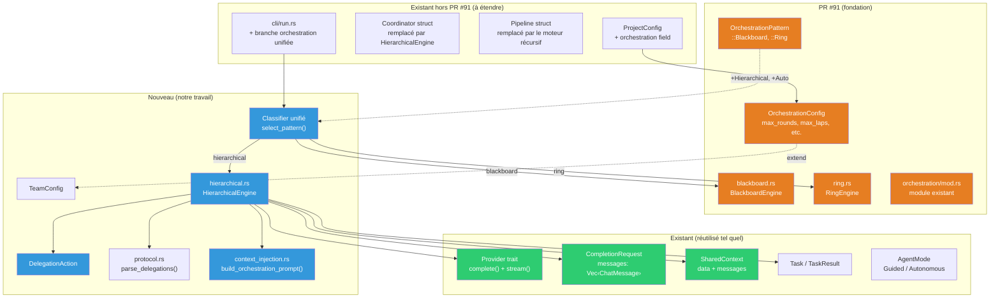

### 9.2. Ce qui ne change PAS

- Le format des fichiers agents (`.md`) reste identique
- Le parser Markdown ne change pas
- Les providers ne changent pas
- Le linker fonctionne comme avant (mais valide l'orchestration si enabled)
- Le storage SQLite ne change pas
- Le TUI/Web ne change pas (future: visualiser la trace de délégation)
- Les patterns **Blackboard** et **Ring** de PR #91 restent intacts — on ajoute sans casser

---

## 10. Points d'attention

### 10.1. Sécurité — Protection anti-boucle

| Paramètre | Défaut | Rôle |
|-----------|--------|------|
| `max_depth` | 5 | Empêche A → B → C → D → ... infini |
| `max_iterations` | 50 | Empêche le coordinateur de boucler indéfiniment |
| `timeout` | 300s | Timeout global (wall-clock) |

### 10.2. Coûts

Chaque invocation d'agent génère des tokens (et donc des coûts). L'orchestration multiplie les appels. Mesures :

- Les `cost_limit` par agent sont respectés
- Le moteur agrège les coûts totaux dans `OrchestrationResult`
- Affichage en fin d'exécution : coût total, tokens totaux, nombre d'invocations

### 10.3. Pas de feature flag supplémentaire

L'orchestration utilise uniquement `Provider.complete()` qui est toujours disponible. Pas besoin de gating derrière une feature. Le code est actif ou non selon `orchestration.enabled` dans la config.

### 10.4. Compatibilité ascendante

- Les projets **sans** section `orchestration` fonctionnent exactement comme avant
- Les projets **avec** `orchestration.enabled: false` fonctionnent comme avant
- Seul `orchestration.enabled: true` active le nouveau comportement

---

## 11. Évolutions futures (hors scope v1)

| Évolution | Priorité | Description |
|-----------|----------|-------------|
| **Tool calling natif** | P2 | Utiliser les tools Anthropic/OpenAI pour `delegate()` au lieu du parsing texte |
| **Parallel dispatch** | P1 | Exécuter les délégations multiples en parallèle (`tokio::join!`) — applicable à Hierarchical ET Blackboard |
| **Streaming** | P2 | Streamer la réponse du coordinateur en temps réel |
| **TUI visualization** | P1 | Arbre de délégation dans le dashboard TUI (tab dédié ou overlay) |
| **Web trace** | P2 | Endpoint `/api/orchestration/trace` pour visualiser l'exécution |
| **Persistent sessions** | P3 | Reprendre une orchestration interrompue (nécessite storage) |
| **Cost budgets** | P1 | Budget max par orchestration (pas seulement par agent) — intégrable via `token_budget` de PR #91 |
| **Dynamic routing** | P3 | Le coordinateur choisit dynamiquement des agents non pré-configurés |
| **Pattern mixing** | P3 | Un Hierarchical lead pourrait utiliser Ring/Blackboard au sein de son équipe |

> **Note** : Certains items initialement hors scope (cost budgets, parallel dispatch) sont
> partiellement couverts par PR #91 (`token_budget`, `max_rounds`). Les prioriser en v1.1.

---

## 12. Impacts sur la documentation, templates et starters

L'orchestration Hierarchical impacte plusieurs couches au-delà du code Rust.

### 12.1. README.md

| Section | Changement |
|---------|------------|
| Features list | Ajouter "Multi-pattern orchestration (Direct, Blackboard, Ring, Hierarchical)" |
| Quick start | Ajouter un exemple minimal de config `orchestration:` dans `armadai.yaml` |
| Architecture overview | Mentionner `src/core/orchestration/` et les 4 patterns |

### 12.2. Wiki (`docs/wiki/`)

| Fichier | Changement |
|---------|------------|
| `agent-format.md` | Documenter comment les agents participent à l'orchestration (pas de changement de format, mais clarifier le rôle du `## Pipeline` section vs orchestration YAML) |
| `providers.md` | Mentionner que tous les providers supportent l'orchestration (via `complete()`) |
| `templates.md` | Ajouter des exemples de templates de coordinateur et de lead |
| **Nouveau** `orchestration.md` | Page dédiée : concepts (4 patterns), config YAML complète, protocole `@agent:`, exemples de topologies, troubleshooting |

### 12.3. Skills et prompts ArmadAI

| Fichier | Changement |
|---------|------------|
| `skills/armadai-agent-authoring/references/format.md` | Ajouter section orchestration : comment créer des agents compatibles (pas de `@` dans le system prompt sauf si orchestré) |
| `skills/armadai-agent-authoring/references/best-practices.md` | Bonnes pratiques pour coordinateurs et leads (system prompt clair, délégation concise) |
| `skills/armadai-agent-authoring/references/examples.md` | Ajouter exemples : coordinateur, lead, agent orchestré |

### 12.4. Starters

| Starter pack | Changement |
|--------------|------------|
| Starters avec `_coordinator.md` | Ajouter une config `orchestration:` dans le `armadai.yaml` du starter |
| `boulanger-experts` | Candidat naturel pour un starter Hierarchical complet (coordinator + leads + agents) |
| `code-analysis-rust` | Ajouter config orchestration avec `lead-analyst` comme coordinator |
| **Nouveau** starter `orchestration-demo` | Starter minimal montrant les 4 patterns avec 3-4 agents |

### 12.5. Agents internes ArmadAI

| Fichier | Changement |
|---------|------------|
| `agents/_coordinator.md` | Mettre à jour le system prompt pour utiliser le protocole `@agent:` au lieu des DISPATCH RULES manuelles |
| `starters/*/agents/*-lead.md` | Ajouter les instructions de protocole de délégation dans les leads existants |

### 12.6. Exemples (`examples/`)

| Fichier | Changement |
|---------|------------|
| `examples/demo-rust-team/` | Ajouter `orchestration:` dans le `armadai.yaml` pour démontrer le mode Hierarchical |
| **Nouveau** `examples/orchestration-patterns/` | Dossier avec 4 sous-exemples (un par pattern), chacun avec son `armadai.yaml` |

---

## 13. Analyse d'impact — PR #91 (@xbattlax)

> Section ajoutée suite à l'analyse croisée entre notre plan Hierarchical et la PR #91.

### 13.1. Ce que PR #91 apporte

| Composant | Description | Fichier attendu |
|-----------|-------------|-----------------|
| `OrchestrationPattern` | Enum avec `Blackboard`, `Ring` | `src/core/orchestration/mod.rs` |
| `BlackboardEngine` | Exécution parallèle, state partagé, rounds itératifs | `blackboard.rs` |
| `RingEngine` | Token-passing séquentiel, vote de consensus | `ring.rs` |
| `OrchestrationConfig` | Params : `max_rounds`, `max_laps`, `consensus_threshold`, `token_budget` | `mod.rs` ou `config.rs` |
| YAML config | Section `orchestration:` dans `ProjectConfig` | `src/core/project.rs` |

### 13.2. Compatibilité avec notre design

| Aspect | Compatible ? | Action requise |
|--------|--------------|----------------|
| Enum `OrchestrationPattern` | ✅ | Ajouter `Hierarchical` et `Auto` |
| `OrchestrationConfig` | ✅ | Étendre avec `coordinator`, `teams`, `max_depth`, `max_iterations`, `timeout` |
| Module `src/core/orchestration/` | ✅ | Ajouter `hierarchical.rs`, `protocol.rs`, `context_injection.rs` dans ce module |
| `ProjectConfig.orchestration` | ✅ | Même champ, config étendue |
| Provider interaction | ✅ | Tous utilisent `Provider.complete()` — pas de conflit |
| CLI integration | ⚠️ | Si PR #91 modifie `run.rs`, merger notre branche orchestration dans la sienne |

### 13.3. Risques identifiés

| Risque | Probabilité | Mitigation |
|--------|-------------|------------|
| **Conflit de merge** sur `project.rs` | 🟠 Haute | Merger PR #91 d'abord (Étape 0), puis étendre |
| **Naming divergent** pour les patterns | 🟡 Moyenne | Audit post-merge pour aligner les noms |
| **Interface engine non unifiée** | 🟡 Moyenne | Proposer un trait `OrchestrationRunner` si PR #91 n'en a pas |
| **Tests qui cassent** | 🟢 Faible | PR #91 a ses propres tests Blackboard/Ring — nos tests Hierarchical sont indépendants |

### 13.4. Décision : Option C — Design unifié

Après analyse des 3 options possibles :
- **Option A** : Ignorer PR #91, implémenter indépendamment → ❌ duplication, conflits futurs
- **Option B** : Attendre PR #91, adapter après → ❌ retard, dépendance passive
- **Option C** : Merger PR #91 comme fondation, intégrer Hierarchical dans le module → ✅ **RETENU**

**Justification** :
1. PR #91 crée l'infrastructure module (`orchestration/`) — on l'utilise
2. Blackboard et Ring sont des patterns complémentaires, pas concurrents
3. Le classifier unifié (`Auto`) bénéficie des 4 patterns
4. Un seul module = un seul point d'entrée pour la documentation et la maintenance
5. Pas de feature flag supplémentaire — tout est sous `orchestration.enabled`

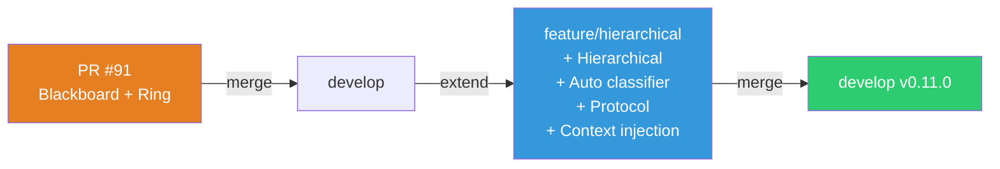
